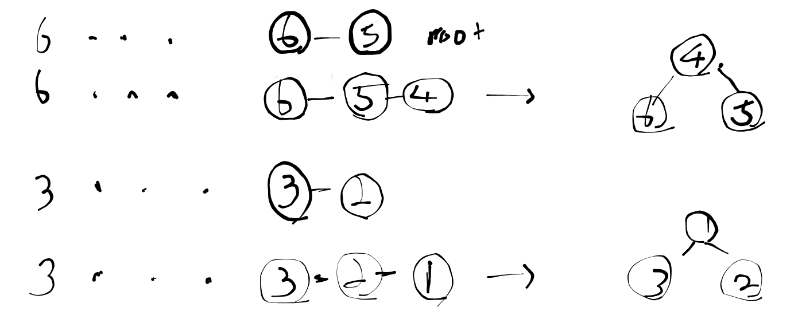

## Link
[공항](https://www.acmicpc.net/problem/10775)

## Topic
- Union Find

## Approach

비행기가 도착하면 가장 뒤쪽 게이트부터 순서대로 도킹해야 한다. 예를 들어 비행기가 5번 게이트까지 사용 가능할 경우, 5번부터 도킹해야 이후 비행기에게 자리를 내어줄 수 있다. 

**(1)** 단순 loop => 시간 초과
1. 게이트의 도킹 여부를 저장하는 배열을 정의한다.
2. 비행기가 도착하면 뒤쪽 게이트부터 비어있는 곳을 탐색한다.
3. 가장 뒤쪽에 있는 빈 게이트에 도킹한다.

게이트를 탐색할 때마다 최대 n번 탐색하여 시간복잡도가 `n^2`이다. 

**(2)** Union-Find
  
Union Find는 최대 n번 탐색할 필요없이 곧바로 비어있는 게이트를 가리킨다. 그러려면 Find 과정에서 Root 노드에 재연결할 필요가 있다.

1. 게이트를 노드로 하는 Disjoint Set을 정의한다.
2. 비행기가 도착하면 (루트) 게이트와 (루트-1) 게이트를 병합한다.
    - 루트 게이트는 비어있는 게이트를 의미한다.
3. 만약 루트 게이트가 0이라면 더이상 슬롯이 없으므로 종료한다.

## Note
- 처음에는 Tree의 병합을 생각했었다. 자식의 크기가 변경되면 부모 노드에도 반영되어야 한다. 예를 들어, 3번 노드가 3개의 자식을 가지고 있을 때, 5번 노드를 조회한다면 `3/5`, 곧 2개 슬롯이 비어있음을 알 수 있어야 한다.

- Uion Find는 가장 가까운 빈 슬롯을 O(1) 만에 찾게 해준다. 

