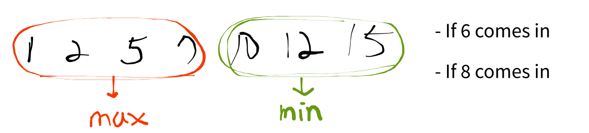

## Link
[가운데를 말해요](https://www.acmicpc.net/problem/1655)

## Topic
- Priority Queue

## Approach
  
 원하는 위치의 값을 O(1)만에 조회하기 위해 Min-Heap, Max-Heap 두 개를 두는 방식을 이용할 수 있다. 위처럼 Min-Heap, Max-Heap의 개수만 조절한다면 항상 원하는 위치의 값만을 가리키도록 할 수 있다.

1. Min, Max 힙을 준비한다.
    - Min Heap은 중간값 이후를 담는다.
    - Max Heap은 중간값 이전을 담는다.
2. Max 힙의 개수를 Min 힙과 같거나 1개 크도록 유지한다.
    - 중간 인덱스를 절삭하기 때문
    - 중간 인덱스를 절상한다면 Min 힙을 1개 크거나 같도록 유지해야 한다.
3. 다음에 넣을 수가 중간값보다 크다면 Min 힙에, 작다면 Max 힙에 넣는다.
4. 넣은 결과 개수가 맞지 않다면 조정한다.
    - Min 힙의 개수가 더 커진다면 Min 힙에서 꺼내 Max 힙으로 하나 옮긴다.
    - Max 힙의 개수가 2 이상 커진다면 Max 힙에서 꺼내 Min 힙으로 하나 옮긴다.