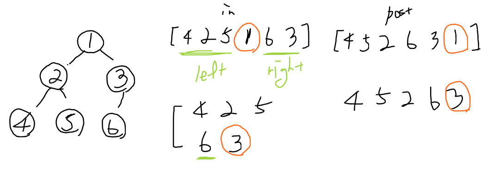

## Link
[트리의 순회](https://www.acmicpc.net/problem/2263)

## Topic
- Recursion
- Divide & Conquer

## Approach
  

Inorder는 항상 root의 위치에서 왼쪽은 왼쪽 서브트리, 오른쪽은 오른쪽 서브트리이고, Postorder는 항상 마지막 부분이 root를 가리킨다. 이를 이용해 재귀적으로 오른쪽과 왼쪽 서브트리를 구성한다.

1. Postorder의 마지막 원소를 현재 노드의 값으로 삼는다.
    - `postRoot`: Postorder에서 현재 루트 노드를 가리킴
2. Inorder에서 위치를 파악하고, 오른쪽 -> 왼쪽 순으로 재귀한다.
    - 이때 서브트리의 루트 노드 구성을 위해 범위를 제한한다.
    - Postorder의 root 노드 인덱스를 한 칸 앞으로 이동한다.
3. 현재 재귀 범위에서 루트 노드를 찾을 수 없으면 재귀를 끝낸다.
    - Postorder를 모두 순회했거나
    - 범위가 유효하지 않거나 (low > high)
    - 현재 Inorder 범위에 root 노드가 없을 경우
