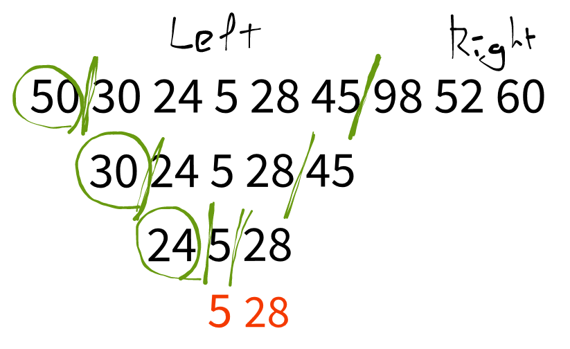

## Link
[이진 검색 트리](https://www.acmicpc.net/problem/5639)

## Topic
- Tree
- Recursion

## Approach
  

전위 순회는 가장 첫 번째 노드가 루트 노드이며, 이진 검색 트리이므로 자신보다 큰 원소를 기준으로 왼쪽이 왼쪽 서브트리, 오른쪽이 오른쪽 서브 트리가 된다.

1. 첫 노드를 루트 노드로 삼고, 자신보다 큰 원소를 찾는다.
    - 큰 원소가 없을 경우 이후 노드는 모두 왼쪽 서브 트리이다.
2. 왼쪽, 오른쪽 서브트리에 대해 재귀적으로 반복한다.
    - 원소가 하나일 경우 리프 노드이므로 재귀를 종료한다.
3. 트리 구성 이후 후위 탐색한다.
   
## Note
- 왼쪽 서브트리가 없는 경우, 오른쪽 서브트리가 없는 경우, 둘 다 없는 경우 모두 고려해야 한다.