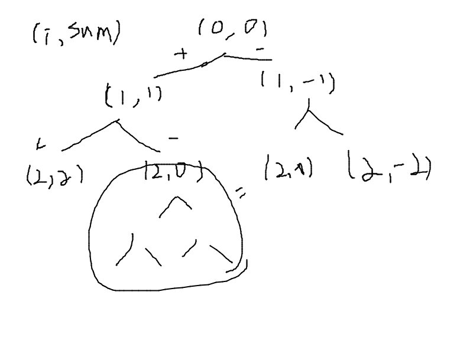

## Link
[Target Sum](https://leetcode.com/problems/target-sum/)

## Topic
* Dynamic Programming (memoization)

## Approach
  

1. Try every possible permutations using back tracking (O(2^))
2. Optimize the back tracking by memoization
3. If the sum of step `n` is the same, then use the memoized value
   