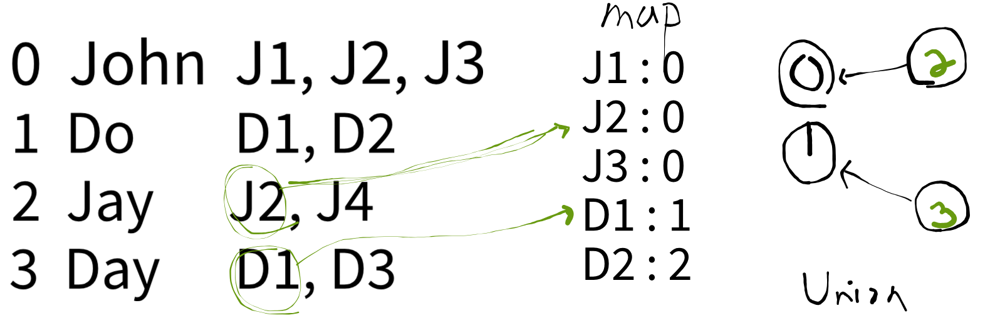

## Link
[Accounts Merge](https://leetcode.com/problems/accounts-merge/)

## Topic
* Union Find

## Approach
  
1. Prepare a disjoint set (linked-list) and a hashmap
    - disjoint set: to merge between accounts
    - hashmap: to indicate which email belongs to which account(name)
2. Iterate through accounts and build a disjoint set, fill the hashmap
    - if an email is already registered in the map, `union()` two accounts
3. Pop all emails from the map and build a result vector
4. Sort the vector and return it
