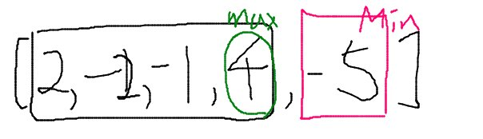

## Link
[Maximum Sum Circular Subarray](https://leetcode.com/problems/maximum-sum-circular-subarray/)

## Topic
* Greedy

## Approach
  

The range of `minSum` is where the sum is kept negative, and the rest of them are increasing.  
No other negative sum exists because if it exists, the range would be merged to the `minSum` range.
  
- Keep track of `maxSum` and `minSum` while iterating the array
    - `maxSum` alone can't fine the max since the starting point is fixed to the index 0
- one of two values are the maximum sum
    - `maxSum` if it is negative value (all the numbers are negative)
    - `total` - `minSum`

