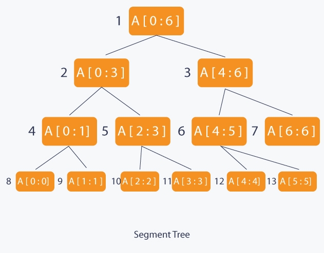
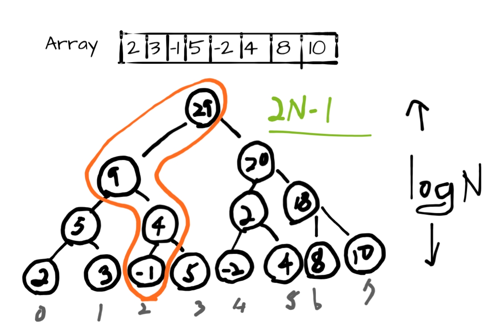

# Segment Tree
  
Segment tree is a full binary tree which node contains information of ranged query of an array. The root represents the whole array `array[0:N]`, and its children the halves of the whole range for each. Before building the tree the two should be considered.
- What kind of data to store?
- What should the merge do?

After having decided those two conditions, it's not possible to change the tree's structure. But the segment tree makes array operations to be performed within `logN` times.

## When to use
  
 Let's assume there's a problem with an array of numbers. In this case the ranged query or aggregation functions should take the time complexity of:
  - **Query**: `sum(array[a:b])` => `O(n)`
  - **Update**: `array[n]=k` => `O(1)`
  
 *If there are **many queries***, constructing it to a segment tree can reduce the time complexity to `O(logN)`, since both query and update operations take `O(logN)`.

## Algorithm
### Build
The completed tree has the root as the entire query, and its children as `[0, n/2]` and `[(n/2)+1, n]`.

1. Start from the leaves of the tree
2. Recursively build the parents from the merge operation

### Query
> Given two integers L and R return the sum of the segment [L, R]

To get the result of the query, divide & conquer approach is used since subqueries are scattered around the tree.

1. If the subquery is inside of the query, return the range sum
2. If the subquery is outside of the query, return zero
3. If the subquery is partially inside of the query, divide the subquery by half

### Update
1. Find the leaf node and update the value
2. Recursively update the parent nodes

## Implementation
### Build
```cpp
void build(int node, int start, int end) {
    // Leaf node reached.
    if(start == end) {
        tree[node] = A[start];
        return
    }

    int mid = (start + end) / 2;
    build(getLeft(node), start, mid);
    build(getRight(node), mid+1, end);
    // Internal node will have the sum of both of its children
    tree[node] = tree[getLeft()] + tree[getRight()];
}
```

### Query
```cpp
int query(
    int node, 
    int start=0, int end=n, 
    int qLeft,   int qRight
) {
    // The range is outside of the query
    if(qRight < start or end < qLeft) {
        return 0;
    }
    // The range is inside of the query
    if(qLeft <= start and end <= qRight) {
        return tree[node];
    }
    
    // The range is partially inside of the query
    int mid = (start + end) / 2;
    int p1 = query(2*node, start, mid, qLeft, qRight);
    int p2 = query(2*node+1, mid+1, end, qLeft, qRight);
    return (p1 + p2);
}
```

### Update
```cpp
void update(
    int node, 
    int start=0, int end=n, 
    int idx, int val
) {
    if(start == end) {
        A[idx] += val;
        tree[node] += val;
        return
    }

    int mid = (start + end) / 2;
    // idx is in the left child
    if(start <= idx and idx <= mid) {
        update(getLeft(), start, mid, idx, val);
    // idx is in the right child
    } else {
        update(getRight(), mid+1, end, idx, val);
    }

    tree[node] = tree[getLeft()] + tree[getRight()];
}
```