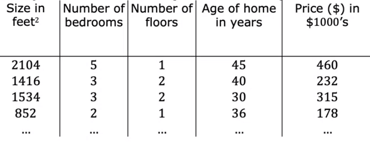
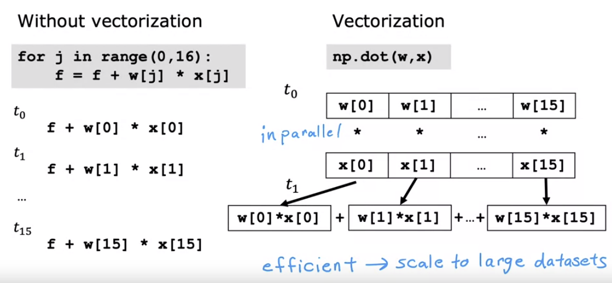
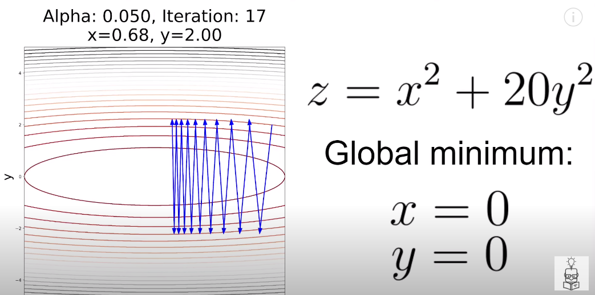
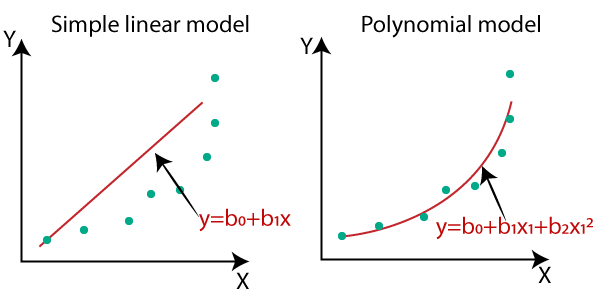

## 🎯 Objectives
- Use vectorization to implement multiple linear regression
- Use feature scaling, feature engineering, and polynomial regression to improve model training
- Implement linear regression in code

## Multiple Linear Regression
### Definition
  
Often regression function has multiple features notated in vector form, which requires generalized gradient descent to decide parameters. 
$$
f_{w,b}(x)=\vec{w}\cdot\vec{x}+b=w_1x_1+\cdots+w_nx_n+b
$$
- $x_{j}^{(i)}$: `j`th feature of `i`th example

### Vectorization
  
`numpy`'s vector calculation is over 100 times faster than usual for-loop, since it utilizes parallel calculation with GPU's hardware support. So it's important to make use of vectorization for efficient data processing.

## Feature Scaling
  
&nbsp;Ranges of numeric features can vary from small to huge. Larger values would lead to small parameters, making its convex-shaped cost function squashed.
- choosing 0.1 for initial $\alpha$ is a good choice for normalized features
- choose the largest reasonable $\alpha$ for faster gradient descent

  
### Problem
&nbsp; Since the learning rate $\alpha$ is evenly applied when updating, the **larger feature might diverge**. This is why feature scaling is needed.

$$
    Let\ J(w,b) = w_1^2+20w_2^2, \ \alpha=0.1\ then
$$  

$$
    w_1=10\rightarrow 8 \rightarrow 6.4 \cdots
$$  

$$
    w_2=10\rightarrow -30 \rightarrow 90 \cdots
$$

### Normalization
feature scaling is needed when **1)** value range is too wide, or **2)** value itself is too large, since it will require learning rate to be tiny enough to slow down gradient descent. 

**By Mean**  

$$
    x=\frac{x-\mu}{max-min}
$$
  
**By Z-Score**  

$$
    x=\frac{x-\mu}{\sigma}
$$

After z-score normalization, all features will have a mean of 0 and a standard deviation of 1.

## Polynomial Regression
  
Regression functions sometimes doesn't fit to linear function. In this case, a part of features needs to be polynomial or feature engineering is needed to create new features.
- Feature scaling should be taken for polynomial parameters
- *Feature Engineering* refers to creating new features by transforming or combining existing features
