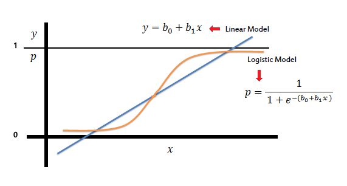
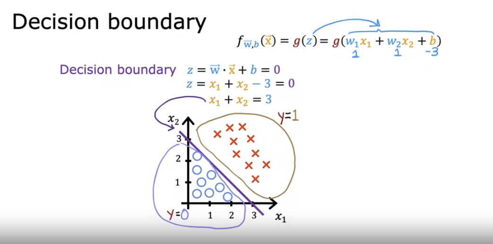
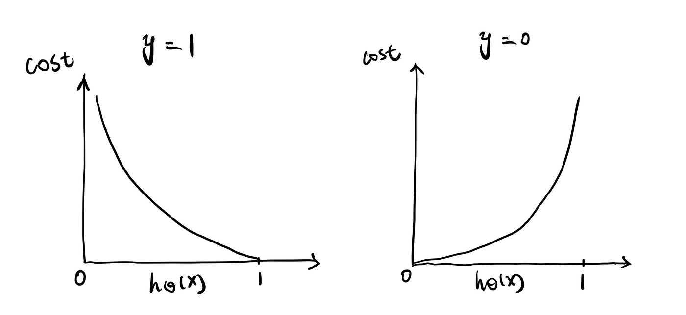
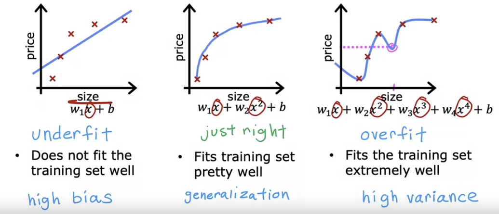

## 🎯 Objectives
- Use logistic regression for binary classification
- Implement logistic regression for binary classification
- Address overfitting using regularization, to improve model performance

## Logistic Regression
  
Logistic regression uses the same basic formula as linear regression but it is regressing the probability of a categorical outcome. It gives a continuous value of `P(Y=1)` for a given `x`, which is converted to Y=0 or 1 based on a threshold value.

$$
    g_{w,b}(x)=\frac{1}{1+e^{f_{w,b}(x)}}
$$  

$$
    f_{w,b}(x)=wx+b
$$

- **sigmoid function**: a function that turns linear regression to probability regression
- **threshold**: a value that decides P(Y=1) or P(Y=0)

### Decision Boundary
  
Decision boundary is a regression function when its output makes the sigmoid function to be threshold. If the threshold is 0.5, then the decision boundary should be $f_{w,b}(x)=0$, since $g(x)=\frac{1}{1+e^{-f(x)}}$.

## Gradient Descent
### Cost Function
  
$$
J(w,b)=\frac{1}{m}\sum^m{Loss(f_{w,b}(x^{(i)}), y^{(i)})}
$$

Cost function now one step further generalized by introducing **Loss** function, which measures difference of a single example to its target value. Below is an popular example of logistic loss function which effectively gives cost of binary classification.

$$
\begin{equation}
  Loss(f_{w,b}{(x)}, y)=\begin{cases}
    -\log{f}, & \text{if $y=1$}\\
    -\log{(1-f)}, & \text{if $y=0$}
  \end{cases}
\end{equation}
$$  

$$
    Loss(f_{w,b}{(x),y})=-y^{(i)}\log{f}-(1-y^{(i)})\log(1-f)
$$

### Gradient Descent
Now that the cost function is ready, it can update parameters using derivative term $\partial{w}$ and $\partial{b}$, with learning rate $\alpha$. If we use the following derivatives of composite function:

$$
\begin{cases}
    J(w,b)=\frac{1}{m}\sum{Loss(f(z))}\\
    Loss(f(z),y)=-y\ln{f(z)}-(1-y)\ln{(1-f(z))}\\
    f(z)=\frac{1}{1+e^{-z}}=\frac{e^z}{1+e^z}\\
    z=wx+b
\end{cases}
$$  

$$
find\ \frac{\partial{J(w, b)}}{\partial{w}}\ and\ \frac{\partial{J(w, b)}}{\partial{b}}
$$  

Surprisingly, the update rule is the same as the one derived by using the sum of the squared errors in linear regression. As a result, we can use the same gradient descent formula for logistic regression as well.

$$
\begin{cases}
    w=w-\alpha\frac{1}{m}\sum{(f_{w,b}(x)-y)}x\\
    b=b-\alpha\frac{1}{m}\sum{(f_{w,b}(x)-y)}
\end{cases}
$$

## Overfitting
    
Generalization emerges when it comes to training model. If the model fits too well to the training data(**overfitting**), it's less likely to predict the new examples well. On the other hand, if the model doesn't fit well to the training data(**underfitting**), the result would be inaccurate as well. 

### How to address
- Gather more training data
- Feature selection
- Reduce size of parameters (`Regularization`)

### Regularization

$$
    J(w,b)=\frac{1}{m}\sum{\frac{1}{2}(f_{w,b}(x)-y)^2}+\frac{\lambda}{2m}\sum^n{w_i^2}
$$

Regularization works by penalizing coefficients that are not important or relevant for prediction. The cost function is modified so that unrelevant parameters would result in small enough values. Then it gives three questions:
- How to choose $\lambda$?
- Which parameters to regularize

The updating rule for `w` will be as below, which indicates that `w` is reduced by little every step of gradient descent:

$$
    w=w-\alpha(\frac{1}{m}\sum{(f_{w,b}(x)-y)x}+\frac{\lambda}{m}w)=w(1-\alpha\frac{\lambda}{m})-\alpha\frac{1}{m}\sum{(f_{w,b}(x)-y)}x
$$  

$$
    b=b-\alpha\frac{1}{m}\sum{(f_{w,b}(x)-y)}
$$

Note that updating `b` remains the same regardless of regularization.

## Questions
- How do you decide degree of polynomial function?
- Why do you use regularization over feature selection?