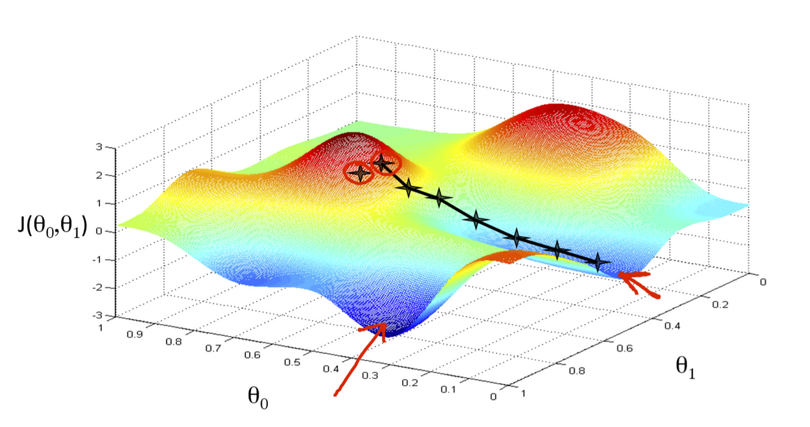

## 🎯 Objectives
- Define supervised/unsupervised machine learning
- Define a regression model
- Implement/Optimize gradient descent

## Overview
> Field of study that gives computers the ability to learn without being explicitly programmed.
>  
> by Arthor Samuel

## Supervised/Unsupervised
### Supervised
  
Supervised learning refers to algorithms that map input to output or `x` to `y` by learning from the given "right answer" dataset. It's once more divided into `Regression` and `Classification`.
- **Regression**: Predicts a number from the approximation function
- **Classification**: Predicts a class from multiple inputs using boundary function
  
### Unsupervised
  
Unsupervised learning refers to algorithms that take only a set of inputs and find structure in the given data. It doesn't requre right answers or labels.
- **Algorithms**: Clustering, Anomaly Detection, Dimension Reduction
- ex) news grouping, DNA Microarray...

## Linear Regression
### Term
- **Training Set**: Data used to train the model
  - feature/target: input `x`, output `y`
  - $(x^{(i)}, y^{(i)})$: `i`th example
- **Model**: Regression function
  - $f_{w,b}(x)$: The model $f(x)=wx+b$
  - $\hat{y}$: an estimate from a model
  - `w`, `b`: parameters, coefficients

### Cost Function
Cost function $J(w,b)$is a function that measures how accurate the model is compared to the training set. Below is `Squred Error Cost Function` which is the most commonly used one for linear regression.

$$
J(w,b)=\frac{1}{2m}\sum_{i}^{m}{(\hat{y}^{i}-y^{(i)})^2}
$$

The goal is to **minimize $J(w,b)$** using varius methods, mainly using `Gradient Descent`.  

## Gradient Descent
  
Gradient Descent is a way to find **local minima** by repeatedly adjusting the parameters according to its gradient. **Convex Function** such as squared error cost function has one and only global minima and therefore never diverges.

### Algorithm
$$
\omega=\omega-\alpha\frac{\partial J(w,b)}{\partial\omega}
$$  

$$
b=b-\alpha\frac{\partial J(w,b)}{\partial{b}}
$$
- **local minima** is found when the cost converges
- $\alpha$ stands for **learning rate**, which becomes aggressive when it's big enough
- `w`, `b` must be updated simultaneously
- (0, 0) is largely used for the initial (`w`, `b`)

### Learning Rate
- if $\alpha$ is too small, it becomes slow to converge
- if $\alpha$ is too large, it might never converge or might diverge
- Around 0.001 is chosen for the initial $\alpha$

### Linear Regression
The algorithm can easily be calculated if the given cost function is linear regression with one variable:

$$
f_{w,b}(x^{(i)})=wx^{(i)}+b
$$  

$$
J(w,b)=\frac{1}{2m}\sum_{i=1}^{m}{(\hat{y}^{(i)}-y^{(i)})}^2
$$

Since partial derivatives are as below, the algorithm now becomes programmable:  

$$
\frac{\partial{J(w,b)}}{\partial{w}}=\frac{1}{m}\sum_{i=1}^{m}{(\hat{y}^{(i)}-y^{(i)})x^{(i)}}
$$  

$$
\frac{\partial{J(w,b)}}{\partial{b}}=\frac{1}{m}\sum_{i=1}^{m}{(\hat{y}^{(i)}-y^{(i)})}
$$

It's called **batch** gradient descent if all of the training set is used for each step of the cost function calculation.