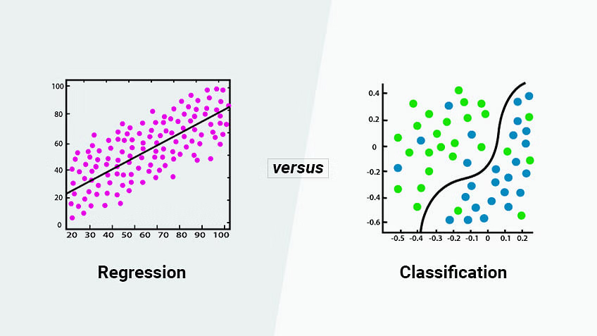
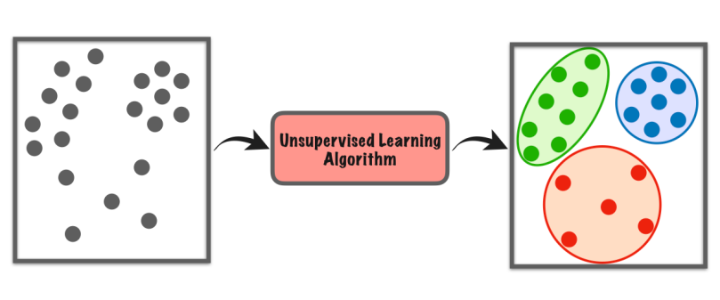

## 🎯 Objectives
- Define supervised/unsupervised machine learning
- Define a regression model
- Implement/Optimize gradient descent

## Overview
> Field of study that gives computers the ability to learn without being explicitly programmed.
>  
> by Arthor Samuel

## Supervised/Unsupervised
### Supervised
  
Supervised learning refers to algorithms that map input to output or `x` to `y` by learning from the given "right answer" dataset. It's once more divided into `Regression` and `Classification`.
- **Regression**: Predicts a number from the approximation function
- **Classification**: Predicts a class from multiple inputs using boundary function
  
### Unsupervised
  
Unsupervised learning refers to algorithms that take only a set of inputs and find structure in the given data. It doesn't requre right answers or labels.
- **Algorithms**: Clustering, Anomaly Detection, Dimension Reduction
- ex) news grouping, DNA Microarray...