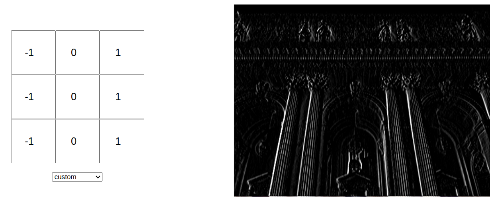
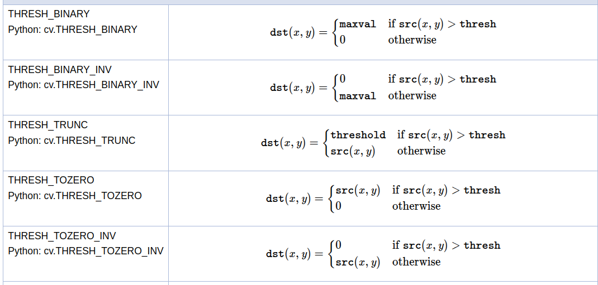
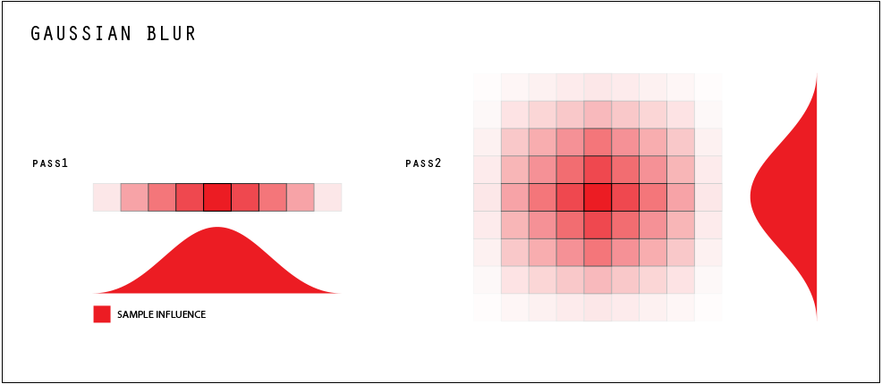
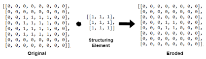
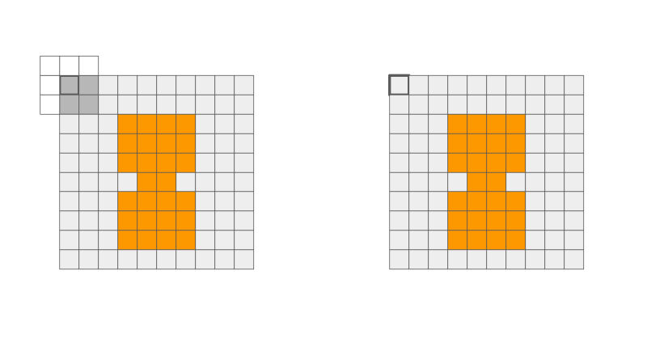
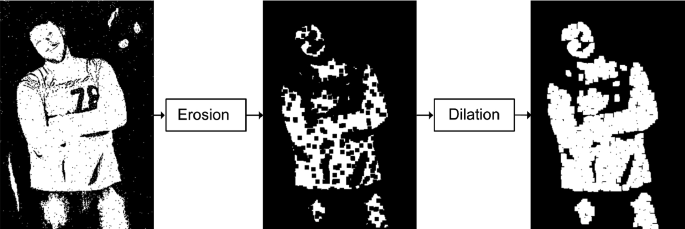
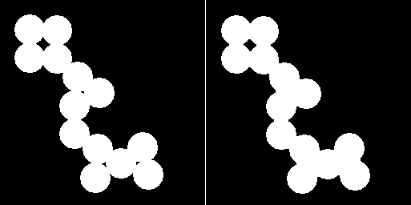

# Image Processing

## Goals
- Perform image operations such as Smoothing, Blurring, Morphologicals
- Grab properties such as color spaces and histograms

## Concepts
### Image Kernel
  
| 🔗 https://setosa.io/ev/image-kernels/  
An **image kernel** is a small matrix (usually 3x3 or 5x5) used to process images by sliding over each pixel and computing a weighted sum of its neighbors. This operation is also called **convolution**.

Kernels are used for various effects, such as blurring, sharpening, edge detection, and more.
The example above calculates the difference in the right way direction, hence capturing the edges in that way. 
## Techniques
### Maksing
1. Prepare a mask: white for the region to keep, black elsewhere.
   - Convert the mask image to grayscale.
   - Use `bitwise_not` if you need to invert white/black.
2. Extract the masked region from the source image using `bitwise_or` (with the `mask` parameter).
3. Combine the masked region with the target image using `bitwise_or`.
   - ⚠️ Both images must be the same size.

```python
# 1. Open the image and the masking image
pic_backpack = cv2.imread("./images/01-dog_backpack.png")
pic_watermark = cv2.imread("./images/01-watermark_no_copy.png")

pic_backpack = cv2.cvtColor(pic_backpack, cv2.COLOR_BGR2RGB)
pic_watermark = cv2.cvtColor(pic_watermark, cv2.COLOR_BGR2RGB)
pic_watermark = cv2.resize(pic_watermark, (600, 600))

# 2. Extract the masking image: black background and white foreground
pic_watermark_mask = cv2.cvtColor(pic_watermark, cv2.COLOR_BGR2GRAY)
pic_watermark_mask = cv2.bitwise_not(pic_watermark_mask)

# 3. Restore the original color of the masking image
pic_watermark_black_bg = cv2.bitwise_or(pic_watermark, pic_watermark, mask=pic_watermark_mask)

# 4. Apply masking to the region of interest
x_offset = pic_backpack.shape[1] - pic_watermark.shape[1]
y_offset = pic_backpack.shape[0] - pic_watermark.shape[0]   
ROI = pic_backpack[y_offset:, x_offset:, :]
ROI_masked = cv2.bitwise_or(ROI, pic_watermark_black_bg)

# 5. Overwrite the completed masking to the original image
pic_backpack[y_offset:, x_offset:] = ROI_masked
```

### Thresholding
`Thresholding` is a simple method of segmenting an image into parts. This will convert an image to consist of only two values: black and white.

#### Global Thresholding
 `threshold()` behave differently by its options:
  

#### Adaptive Thresholing
Adaptive thresholding calculates a threshold value for small, local regions of the image, allowing for better segmentation when lighting conditions are uneven. This is especially useful for detecting edges.

**Function:**  
`cv2.adaptiveThreshold(src, maxValue, adaptiveMethod, thresholdType, blockSize, C, dst=None)`

**Parameters:**
- `src`: Input grayscale image (must be single channel).
- `maxValue`: Value to assign to pixels exceeding the threshold (usually 255).
- `adaptiveMethod`: How the threshold value is calculated for each pixel:
  - `cv2.ADAPTIVE_THRESH_MEAN_C`: Mean of the neighborhood area. (Widely used)
    - $\text{Threshold}=\text{MEAN}-C$
  - `cv2.ADAPTIVE_THRESH_GAUSSIAN_C`: Weighted sum (Gaussian window) of the neighborhood area.
- `thresholdType`: Type of thresholding (usually `cv2.THRESH_BINARY` or `cv2.THRESH_BINARY_INV`).
- `blockSize`: Size of the neighborhood area (must be odd, e.g., 11(11x11) or 15(15x15)).
  - Must be odd number to ensure the current pixel is in the center of the block
- `C`: Constant subtracted from the mean or weighted mean (fine-tunes the threshold).
  
### Blurring

blurring hides details of an image, or reduce noise of an image. Often used for general **noise reduction** or when a simple, fast blur is needed. 

#### Mean
All pixels in a kernel are given the same weight, and their values are averaged to create the new value for the pixel value.
- Provides a simple, even blur across the image
- Quick and dirty blur
```python
cv2.blur(image, ksize)
```

#### Gaussian
Pixels are weighted based on a Gaussian (bell curve) function. Pixels closer to the center of the kernel have a higher weight. It's possible to separate row-wise and column-wise filtering. 
- Produces a softer, more visually pleasing blur
- Edges better than mean blur by preserving details better 
```python
# sigmaX/Y for std deviation of kernel in X/Y axis
cv2.GaussianBlur(
  image, ksize, sigmaX, sigmaY
)
```

### Morphological Operator
A set of kernels for various effects, such as reducing noise. Popular operations include `Erosion, Dilation, Opening, Closing`. `Erosion` and `Dilation` are fundamental operations.

#### Erosion
  
Erosion shrinks the edges of an object in an image. If the structuring element does not fully overlap with the foreground pixels, the center pixel is removed(set to 0). 
  - **Noise Reduction**: effective in removing 'salt-and-pepper' noise
  - **Object Separation**: can separate two objects close together


#### Dilation
  
Adds pixels to the boundaries of foreground regions in an image, making them grow. In most cases n-by-n kernel of ones convolves over the image, making edge pixels to blender to brighter neighborhood. 
  - **Filling Gaps**: connects broken parts of objects (ex - scanned documents) -> smoothing
  - **Enlarging**: makes objects larger and more visible

#### Opening
  
An erosion followed by a dilation. This removes small, isolated objects/noises.
1. **Erosion** -> shrinks the foreground objects and removes salt-like noise
2. **Dilation** -> expanding the remaining objects back to original size


#### Closing
  
A dilation followed by an erosion. This closes small holes which expanded during the first dilation step.
1. **Dilation**: expands objects and fill in small holes
2. **Erosion**: shrinks the dilated objects back to original size, but not those holes integrated to the objects
