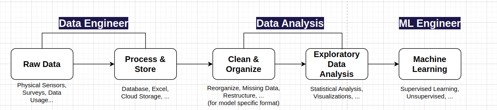

# Data Science

## Analysis Steps
  
- 1. Data Engineering: Scrape and label necessary data from web
- 2. Data Analysis: Explore through data to gain insights
  - Clean & Organize: `pandas`, `numpy` to organize data
  - Exploratory Data Analysis (EDA): `seaborn` to visualize and report
- 3. Result: Verify the problem statement.
  - *ex) Does Fandango display artificially higher than average reviews?*

## Learnt
#### Seaborn's Joint Grid and Pair Grid
- **Context**: I wanted grid-style plots to explore relationships between columns
  - **Joint Grid**: Shows joint distribution plus marginal distributions on the axes (multiple plots)
  - **Pair Grid**: Shows all pairwise relationships across columns.