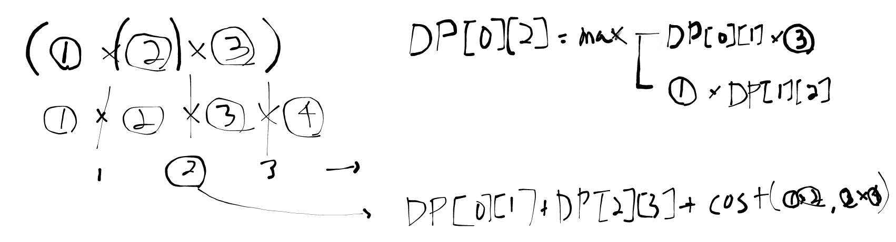

## Link
[행렬 곱셈 순서](https://www.acmicpc.net/problem/11049)

## Topic
- DP (2차원)

## Approach
   

1. **Subproblem**: `DP[i][j]`, i번째부터 j번째까지 곱한 결과 최소 비용
2. **Guess**
    - 무엇을 소개할 것인가? => 행렬을 하나씩 추가한다.
    - 어느 방향으로 탐색할 것인가? => i~j까지 크기를 하나씩 늘린다.
3. **Recurrence**: `DP[i][j]`에 대한 최소 비용 행렬곱은 i~j 사이를 2등분 했을 때
    - dp[i][cut] + dp[cut+1][j] + getCost(i, cut, j) 중 최소값
    - `getCost()`는 `i~cut`, `(cut+1)~j` 두 행렬의 곱 비용을 말한다.
4. **Solve**: `DP[0][n-1]`
