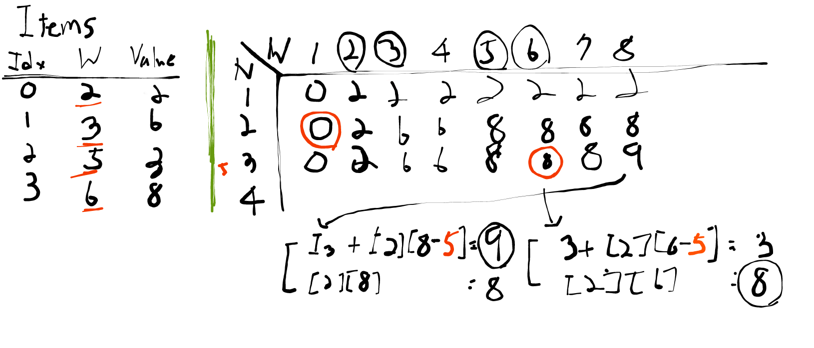

## Link
[평범한 배낭](https://www.acmicpc.net/problem/12865)

## Topic
- DP (Knapsack)

## Approach
  

 Knapsack 문제는 고려할 물건 번호를 행, 무게를 열로 하는 2차원 배열로 풀 수 있는 것이 잘 알려져 있다.
 주의할 점은 행은 물건의 개수가 아니라 N번 물건까지 고려하는 것으로, 단계마다 새로운 물건이 소개되어야 한다. 이렇게 함으로써 새로운 물건을 택하는 경우, 택하지 않는 경우 두 가지로 구분할 수 있다. 개수만으로는 구분/비교하기가 힘들다.

1. **Subproblem**: `DP[N][W]`, N번 물건까지 고려했을 때, 무게 W 제한에서 가질 수 있는 최고 가치
2. **Guess**: `DP[N][W]`의 이전 단계는 무엇이고, 어떻게 선택할 것인가?
3. **Recurrence**: `DP[N][W]`은 두 가지 경우에서 더 큰 가치를 택한다. `In`을 새로 택할 물건이라 할 때
   - `W(In) + DP[N-1][W-W(In)]`: `In`을 택하는 경우
   - `DP[N-1][W]`: `In`을 택하지 않는 경우
4. **Solve**: `DP[N][W]`
