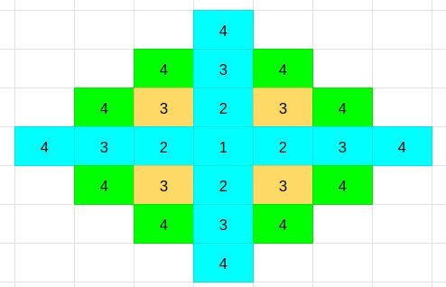

## Link
[테트로미노](https://www.acmicpc.net/problem/14500)

## Topic
- DFS
- 백트래킹

## Approach
  

ㅗ 모양의 블록을 제외한 다른 블록을 모두 합칠 경우 깊이 4의 DFS가 탐색하는 범위와 같다.
모든 지점에 대해 깊이 4의 DFS로 탐색해보고, ㅗ는 별도의 로직으로 탐색한다.

1. 모든 지점을 돌며, 깊이 4의 DFS 탐색을 진행한다.
    - 한 DFS가 끝났을 때 다른 DFS도 가능해야 하므로 백트래킹을 이용한다.
2. DFS를 빠져나오면서 visited 배열을 False로 되돌린다. (백트래킹)
3. DFS 이후 ㅗ 블럭 탐색을 진행한다
    - 동서남북으로 3블럭을 더하고, 중간 블럭의 양 옆을 비교한다. (총 8개 경우)
4. 가장 큰 값을 출력한다.

## Note
- 백트래킹 과정에서 visited 배열은 항상 false로 초기화되므로 매 탐색마다 초기화할 필요가 없다.

