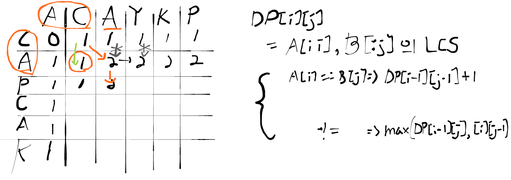

## Link
[LCS 2](https://www.acmicpc.net/problem/9252)

## Topic
- DP (2차원)

## Approach
  

LCS는 2차원 DP로 잘 알려진 문제이다. DP[i][j]는 두 텍스트에 대해 i번째까지, j번째까지 고려한 것의 LCS를 의미한다. DP[0][0]부터 시작하여 둘 중 어느 하나를 하나씩 늘려가면서 비교하면 테이블을 끝까지 채울 수 있다.

1. **Subproblem**: `DP[i][j]`, TextA[:i], TextB[:j]의 LCS
2. **Guess**: TextA[i]와 Text[j]가 같은 경우, 다른 경우 어떻게 계산할 것인가?
3. **Recurrence**: `DP[i][j]`는 비교하는 문자가 같은지, 다른지에 따라 다음과 같이 계산된다.
   - `max(DP[i-1][j], DP[i][j-1])`, 문자가 다른 경우
   - `DP[i-1][j-1] + 1`, 문자가 같은 경우
4. **Solve**: `DP[I][J]`

이 문제에서는 최장 문자열도 함께 구해야 하므로 DP 테이블에는 개수 대신에 문자열을 넣는다.

## Note
- string은 연산이 느리기 때문에 char 자료형을 역추적해야 한다.