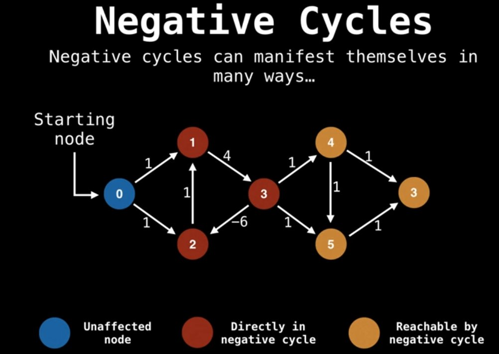

# Shortest Path
- [Shortest Path](#shortest-path)
  - [Dijkstra](#dijkstra)
    - [Algorithm](#algorithm)
    - [Pseudo Code](#pseudo-code)
    - [Time Complexity](#time-complexity)
  - [Bellman-Ford](#bellman-ford)
    - [Algorithm](#algorithm-1)
    - [Pseudo Code](#pseudo-code-1)
  - [Floyd Warshall](#floyd-warshall)
    - [Algorithm](#algorithm-2)
    - [Pseudo Code](#pseudo-code-2)
    - [Time Complexity](#time-complexity-1)
  - [Questions](#questions)


This document explains popular algorithms for finding the shortest path between vertices. 

## Dijkstra
 Given a set of vertices and edges, Dijkstra algorithm finds the shortest paths **from the source** to all vertices. It's a greedy algorithm that finds the shortest subpaths from the source `A` to the destination `D`, meaning that any subpath in between `A -> D` is also the shortest path from `A`.  
  - Dijkstra can't be used with negative edges since it's a greedy algorithm that can't be fixed afterwards

### Algorithm
  
1. Prepare two 1d arrays and a priority queue.
    - **distance**: updates shortest distance
    - **previous**: updates shortest path (previous vertex)
    - **priority queue**: queue of unvisited vertices, sorted by distance
2. Start from the source, examine distances to adjacent vertices.
    - Put a pair of [adjacent node, cost `source -> adj node`] to the priority queue
    - Update distances of the `distance` array
    - Update previous vertex of the `previous` array
3. Pick the shortest one and pop from the priority queue.
   - It's the shortest subpath from the source
4. Repeat until no vertex is left in the priority queue.

### Pseudo Code
The pseudo code below is gotten from [Wikipedia](https://en.wikipedia.org/wiki/Dijkstra%27s_algorithm).  
```cpp
 1  function Dijkstra(Graph, source):
 2      
 3      for each vertex v in Graph.Vertices:
 4          dist[v] ← INFINITY
 5          prev[v] ← UNDEFINED
 6          add v to Q
 7      dist[source] ← 0
 8      
 9      while Q is not empty:
            // Use completed[bool] array when implementing
            // for practical reason.
10          u ← vertex in Q with min dist[u]
11          remove u from Q
12          
13          for each neighbor v of u still in Q:
14              alt ← dist[u] + Graph.Edges(u, v)
15              if alt < dist[v]:
16                  dist[v] ← alt
17                  prev[v] ← u
18
19      return dist[], prev[]
```

### Time Complexity
- `O(V logE)` if priority queue is used
- `O(V^)` if vector is used

## Bellman-Ford
| 🔗 [Naver Blog](https://10000cow.tistory.com/entry/%EB%B2%A8%EB%A7%8C-%ED%8F%AC%EB%93%9C-%EC%95%8C%EA%B3%A0%EB%A6%AC%EC%A6%98-%ED%95%9C-%EC%82%B4%EB%8F%84-%EC%9D%B4%ED%95%B4%ED%95%98%EB%8A%94-%EB%B2%A8%EB%A7%8C-%ED%8F%AC%EB%93%9C-%EC%95%8C%EA%B3%A0%EB%A6%AC%EC%A6%98Bellman-Ford-Algorithm)  

  

Bellman Ford finds the shortest paths **from the source to all vertices** and can be used even with a graph which has negative edges and a cycle. Such a case, Dijkstra can't find the exact cost since it will be stuck in a infinite loop if it meets a negative weights cycle. 
  - The distances of cycle-affected nodes are still inaccurate
 
### Algorithm
The algorithm is itself a slower version of Dijkstra which doesn't get stuck at a negative cycle. 

1. Initialize an distances array as infinites and zero to the source node
2. Iterate every edge `|V|-1` times
    - The shortest path between `V` nodes contains at most `V-1` edges
    - It ensures visiting all the vertices
3. Update the distances array on an edge `(u,v)` if
    - `distances[v] > distances[u] + weight(u, v)`
4. Detect a negetive cycle while iterating every edge again
    - `distances[v] > distances[u] + weights(u, v)` -> a cycle

### Pseudo Code
```c
function bellmanFord(G, S)
  for each vertex V in G
    distance[V] <- infinite
    previous[V] <- NULL
  distance[Start] <- 0

  for i = 1...(|v|-1)
    for each edge (U,V) in G
      tempDistance <- distance[U] + edge_weight(U, V)
      if tempDistance < distance[V]
        distance[V] <- tempDistance
        previous[V] <- U

  // to detect all the vertices affected,
  // repeat |V|-1 times.
  for each edge (U,V) in G
    If distance[U] + edge_weight(U, V) < distance[V]
      Error: Negative Cycle Exists

  return distance[], previous[]
```

## Floyd Warshall
Floyd Warshall finds the shortest paths **between all the pairs of vertices**. It follows dynamic programming approach for its implementation. 

### Algorithm
1. Prepare a distance table and a path table.
   - path table records previously visited vertex
2. Iterate through all the intermediate vertices `k`
3. Update the tables if the direct distance is greater than the intermediate distance.
   - `dist[a][b] > dist[a][k] + dist[k][b]`

| Graph | Matrix |
|:------:|:------:|
| |  |

| Step 1 | Step 2 |
|:------:|:------:|
|  |  |

| Step 3 | Step 4 |
|:------:|:------:|
|  |  |

### Pseudo Code
The pseudo code below is gotten from [Wikipedia](https://en.wikipedia.org/wiki/Floyd%E2%80%93Warshall_algorithm#Pseudocode).  
```cpp
let dist be a |V| × |V| array of minimum distances initialized to ∞ (infinity)

for each edge (u, v) do
    dist[u][v] ← w(u, v)  // The weight of the edge (u, v)
for each vertex v do
    dist[v][v] ← 0
for k from 1 to |V|
    for i from 1 to |V|
        for j from 1 to |V|
            if dist[i][j] > dist[i][k] + dist[k][j] 
                dist[i][j] ← dist[i][k] + dist[k][j]
            end if
```

### Time Complexity
`O(V^3)`

## Questions
> Time compexities for Dijkstra and Floyd Warshall are `O(V logE)` and `O(V^3)`. Isn't it better to iterate all the vertices using Dijkstra than using Floyd?
