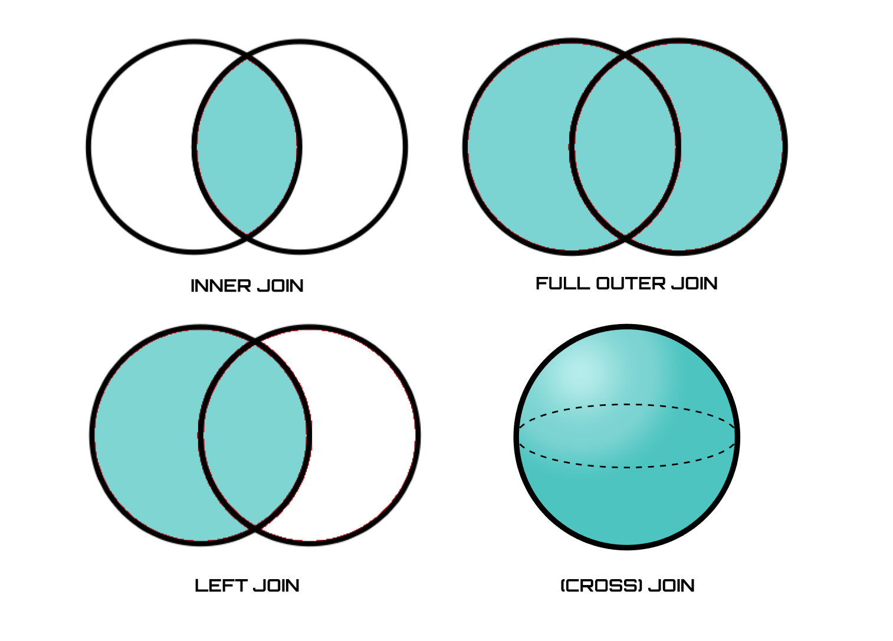
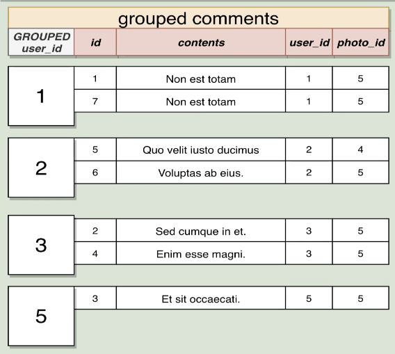

# Database and Table
  
Design a database of minimized Instagram having features such as:
  - Users have followers and can follow other users
  - Users can like a photo
  - Users have a profile page and post a list of photos
  - comments are created by users

## Components
### Relationship
  
Relationships are a basic building block between tables. It's important to state a relationship in the perspective of one table, such as `A user has multiple photos, and a photo has only one user`.

Associated two tables can be read using `JOIN` keyword
```sql
-- `username` belongs to `users` table
SELECT url, username FROM photos
JOIN users ON users.id = photos.user_id;
```

## Keys
```sql
CREATE TABLE cities(
    id SERIAL PRIMARY KEY,
    name VARCHAR(50),
    user_id INTEGER REFERENCES users(id) ON DELETE CASCADE
);
```
- **Primary Key** : Uniquely identifies a record in the table
    - may use an auto generated IDs using `SERIAL` keyword
- **Foreign Key** : Identifies a record that a row is associated with
    - use keyword `REFERENCES <table>(<column>)` to point at some foreign table
  
## Constraints
`Constraint` is defined on foreign keys to deal with changes with the foreign table's records being referenced. Below are its options:
- `ON DELETE NO ACTION`: by default. throws an error
- `ON DELETE RESTRICT`:  throws an error
- `ON DELETE CASCADE`: delete the associated records, too
- `ON DELETE SET NULL`: set the foreign key column's value to 'NULL'
- `ON DELETE SET DEFAULT`: set the foreign key column's value to the default 

## Join
 `JOIN` produces values by merging rows together from different tables having relationships, mostly by foreign key references. Below are SQL use-cases using JOIN.  

### Types
  
#### Inner Join
```sql
SELECT * FROM phones
JOIN users ON users.is = phones.user_id;
```
Results in only the records matching the keys that exist both the table `users` and `phones`. Other records are discarded.

#### LEFT/RIGHT OUTER JOIN
```sql
SELECT * FROM phones
LEFT/RIGHT JOIN users ON users.id = phones.user_id;
```
Results in printing all the records on the left / right table and set to NULL on the other columns not matching the foreign keys. In this case, `phones` (the table selecting from) is to be `LEFT` and `users` to be `RIGHT`.

### UNION/INTERSECT/EXCEPT
```sql
-- Parentheses are syntax error, remove them before running a query.
(
    SELECT *
    ...
)
UNION/INTERSECT/EXCEPT (ALL)
(
    SELECT *
    ...
);
```
- `Union`: appends rows of two connecting queries, and removes duplacates by default. 
- `INTERSECT`: finds rows that exist in both queries.
- `EXCEPT`: takes out the latter rows from the first query.

Column names and data types should be matching to properly join two queries.

## Group
  
 Grouping reduces rows down to fewer rows using the `GROUP BY` keyword. Ungrouped columns cannot be `SELECT`ed or else such columns should be applied with `aggregates` functions.
 - **aggregates**: `COUNT`, `SUM`, `AVG`, `MIN`, `MAX`, ...
 - `COUNT(*)`: counts the number of all rows 
 - priorities between operations are: `FROM` > `JOIN` > `WHERE` > `GROUP BY` > `HAVING`
```sql
-- Given a table of phones, print the names of manufacturers and total revenue (price * units_sold) for all phones.  Only print the manufacturers who have revenue greater than 2,000,000 for all the phones they sold.
SELECT manufacturer, SUM(price * units_sold)
FROM phones
GROUP BY manufacturer
HAVING SUM(price * units_sold) > 2000000;
```

## Subquery
```sql
-- subquery as a source of a value
SELECT p1.ratio,
    (SELECT COUNT(name) FROM products)
-- subqueries as a source of rows
FROM (
    SELECT id, price/weight AS ratio FROM products
) AS p1
JOIN (SELECT * FROM products) AS p2 ON p1.id = p2.id
-- subquery as a source of a column
WHERE p1.id IN (SELECT id FROM products);
```
Subqueries are useful in combining multiple tables to make complex queries as it needs. For example, scalar queries or column queries can be a value in `WHERE` statement.
- subqueries in `FROM` must have an alias to refer to it
- subqueries returning data compatible with `ON` clause can be used in `JOIN` (e.g. IDs)

### ALL/SOME
```sql
SELECT name, price FROM products
WHERE price > SOME (
    SELECT price FROM products
    WHERE department = 'Industrial'
);
```
`ALL`, `SOME` operators are combined with logical operators to check whether a value matches all or at least one condition specified in `WHERE` clause.

### Correlated
```sql
SELECT name, department, price
FROM products as p1
WHERE price = (
    SELECT MAX(price)
    FROM products AS p2
    WHERE p1.department = p2.department
);
```
Subqueries run like a nested `for` loop for every row on the outer table. The example above results in the rows with the highest price of each department. Note that the time complexity is `N^2`.
