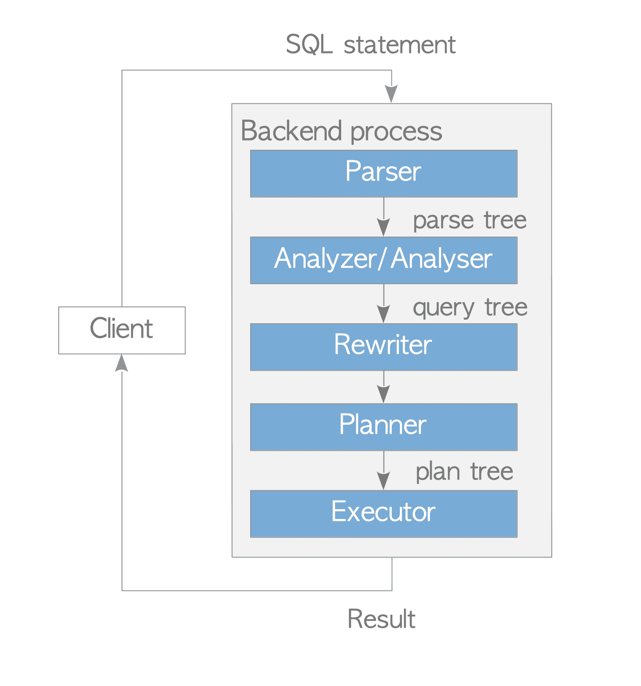

# Tuning
## Phases
  

- `Parse`: Create a parse tree of SQL statement
- `Rewrite`: Replace a part of parse tree to make use of already materialized views on memory, instead of fetching and searching all the data from scratch.
  - `ex - UNION, JOIN, etc`
- `Planning`: Chooses the optimal order of re-written query execution, using `LOOP`, `SCAN` or else that is logical operator. 
  - chooses a plan between `scanning index first` or `skip it and scan the full table`


### Explain
```sql
EXPLAIN SELECT username, contents
FROM users
JOIN comments ON comments.user_id = users.id
WHERE users.username LIKE 'Adelbert_Mertz47';

Hash Join  (cost=175.82..1962.62 rows=11 width=81)
  Hash Cond: (comments.user_id = users.id)
  ->  Seq Scan on comments  (cost=... rows=... width=...)
  ->  Hash  (cost=... rows=1 width=17)
        ->  Seq Scan on users  (cost=... rows=1 width=17)
              Filter: ((username)::text ~~ 'Adelbert_Mertz47'::text)
```
`EXPLAIN` shows the result of query planning of a query, including the cost of each operation and the number of rows and the depth of width to the data associated.
  - `ANALYZE` also executes and shows the result of the query
  - `cost`: Amount of processing power required to exeute the step
  - `rows`: The number of items to be generated by the step
  - `width`: The guess at the average number of bytes for each row

### Cost
Cost is typically calculated based on number of rows/pages affected and [constant factors](https://www.postgresql.org/docs/current/runtime-config-query.html#RUNTIME-CONFIG-QUERY-CONSTANTS). An example is:
```plain
COST = (#pages read sequentially) * seq_page_cost 
       + (# pages read at random) * random_page_cost 
       + (# rows scanned) * cpu_tuple_cost 
       + (# index entries scanned) * cpu_index_tuple_cost 
       + (# times function/operator evaluated) * cpu_operator_cost
```

## Common Table Expression (CTE)
```sql
WITH tags AS (
    SELECT user_id, created_at FROM photo_tags
    UNION ALL
    SELECT user_id, created_at FROM caption_tags
)
```
CTE is an alias for simplifying complex queries and making them more readable to other developers. It can acts either as an alias or a tool for recursive query.

## Recursive
```sql
-- countdown CTE has `val` column, explicitly.
WITH RECURSIVE countdown(val) AS (
	-- Initial Non Recursive Query
    SELECT 3 AS val 
	UNION
  -- Recursive Call (Working Table)
	  SELECT val-1 FROM countdown WHERE val > 1
)
```
  
 Every recursive CTE has `UNION` keyword in it to call the CTE recursively as above. The escape condition should be provided to `WHERE` statement. This is useful when discovering in-depth data in tree or graph-shaped data structure, such as Instagram's following tree. 

 The recursive part will continue to be called until no rows are returned from the `Working Table` of CTE, meaning that the table `countdown` has initially only 3 as its row. Then it uses the last row of each step as its table and append it to the `Result Table`