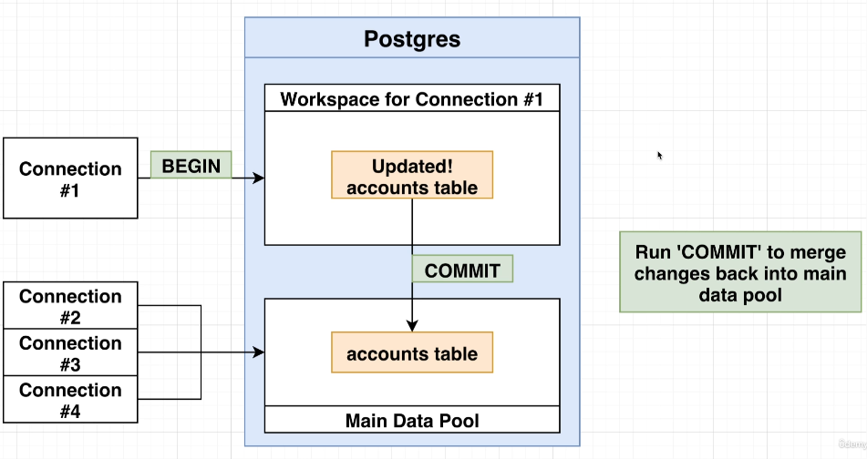

## View

### Simple View
```sql
-- create a view
CREATE VIEW tags AS (
        SELECT id, created_at, user_id, post_id, "photo_tag" AS type
        FROM photo_tags
    UNION ALL
        SELECT id, created_at, user_id, post_id, "photo_tag" AS type
        FROM caption_tags
);

-- change a view
CREATE OR REPLACE VIEW recent_posts AS (
    -- new query
);

-- drop a view
DROP VIEW recent_posts
```
A view is a fake table residing in memory that can be reffered to anytime after creating it, whereas CTE is only valid during the script execution. 
- View is useful when creating a new table with existing data, without touching the original ones.
- Views execute its query every time when it's refered 

### Materialized View
> [PostgreSQL Materialized View](https://www.postgresql.org/docs/current/sql-creatematerializedview.html)  
```sql
CREATE MATERIALIZED VIEW <table name> AS (
  -- sql statements
) WITH [NO] DATA;

-- Refresh the view later
REFRESH MATERIALIZED VIEW <table name>;
```
Materialized ones execute its query only at specific times such as once a week or once a day. The results are saved and can be referenced without rerunning the query. It automatically runs the query on its creation time unless `WITH NO DATA` option is provided.
- can benefit from performance by creating a table adapting to system's usecases
  - `ex) the 10 most recent posts -> can be used at many use-cases`
- If the data set is large and want to populate at another time, use `WITH NO DATA` option.
- Should be regularly refreshed to keep updated, otherwise it might have no longer invalid data.

## Transaction
  
- `BEGIN` to start a transaction section, which is isolated from other connections.
- Writing operations won't immediately applied to the table until `COMMIT` runs
- Loosing connection or crashing leads to automatic `ROLLBACK`
- When there's an error while on transaction, it becomes `aborted` state, and can be resolved by `ROLLBACK`