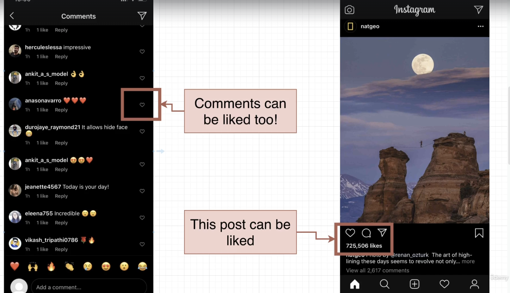
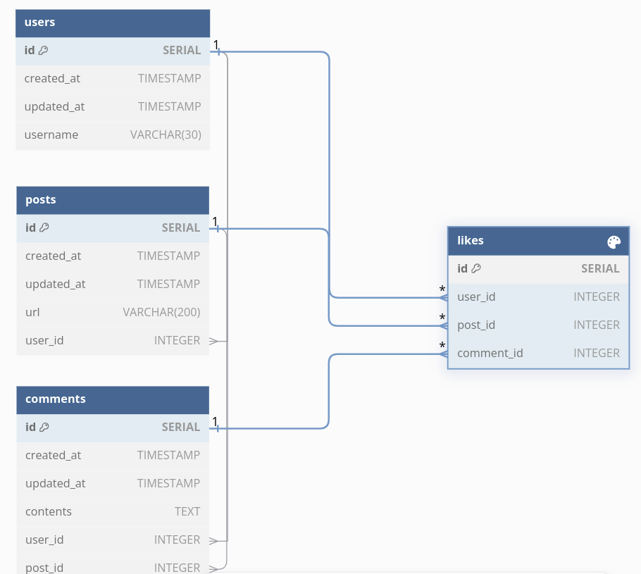
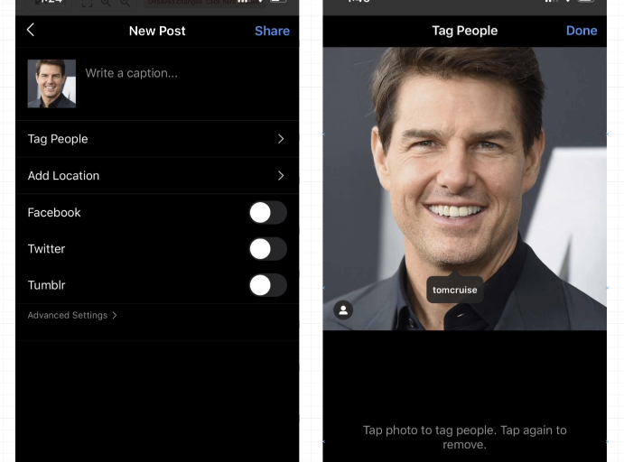
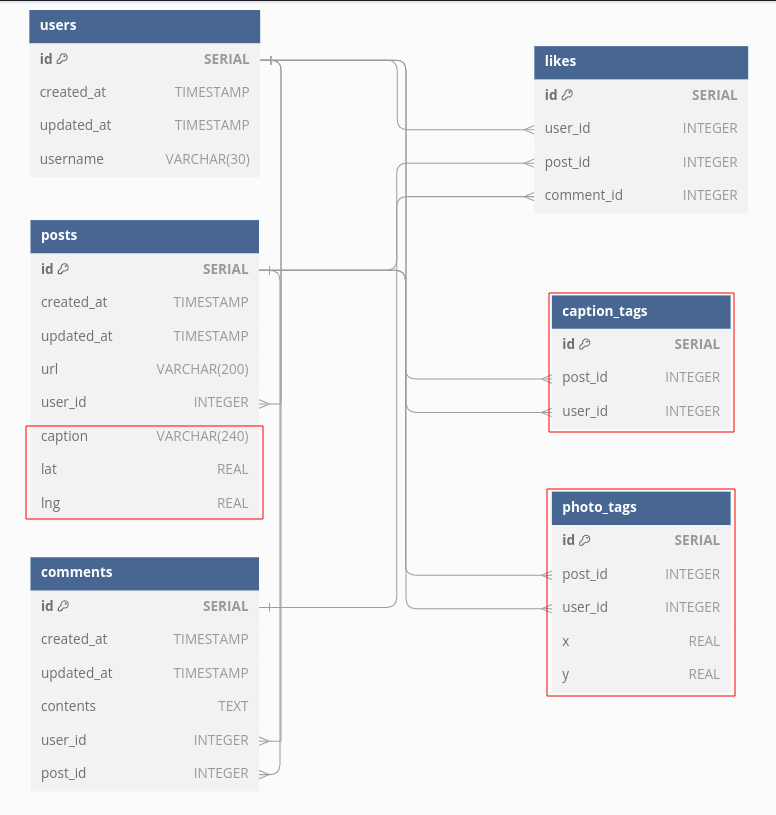
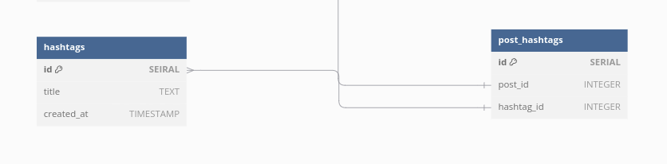

# Instagram DB
> ❗️To import `04-instagram-data`, create an empty table and then choose [right click] > [Restore] (check Do Not Save > Owner).

## Like
  

### Features
- Each user can like a specific post a single time
  - `UNIQUE` constraint to `user_id, post_id`
- A user should be able to 'unlike' a post
- Need to be able to figure out how many users like a post
- Need to be able to list which users like a post
  - create a relation table between `users` and `posts` tables
- Something besides a post might need to be liked
- We might want to think about 'dislikes' or other kinds of reactions

### Diagram
  
```sql
-- The number of likes of a specific user
SELECT COUNT(*) FROM likes WHERE user_id = <id>
-- The list of users who like a post
SELECT username FROM likes WHERE post_id = <id>
```
- many-to-many relationships need to have relation table between the two
- as for similar features like 'reaction', additional columns can be added to the relation table

The diagram takes polymorphic association to the relation table `likes` over `posts` and `comments`, but separate the columns to make use of foreign key. Since we don't have any specific features to a type of likes, it's not nessesary to have all the distinct relation tables for likes.  

## Mention
  

### Features
- A post can have a picture and a caption which describes it
- Users can mention another people by tagging on a post or in a caption
- A post can have a geo-location coordinates
- Need to show a list of posts a user is mentioned in
- A user can set where a tag would be located on a photo

### Diagram
  
- `x, y` columns on `photo_tags` mean the location of a tag on a photo
- separate two types of tags tables since they works independently to each other

## Hashtag
|||
|---|---|
|  |  |

### features
- hashtags can appear at various locations: posts, comments, messages, search and etc.
- users can search a hashtag to see related posts and the number of them.

### diagrams
  
- hashtags would be associated on application layer
- creates `post_hashtags` to know the number of posts and to be able to search for posts by a hashtag

## Import to pgAdmin
Default `CREATE` schema can be auto-generated, but not the validation rules and constraints.
- add `CHECK`, `UNIQUE` rules
- edit foreign keys to have `ON DELETE` constraints
- add `UNIQUE` rules