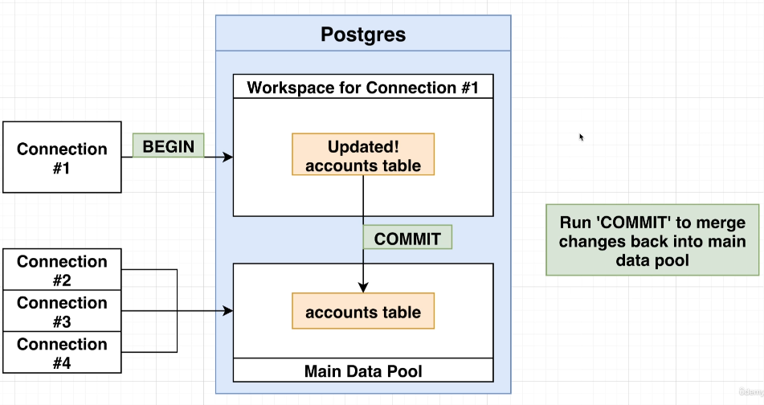
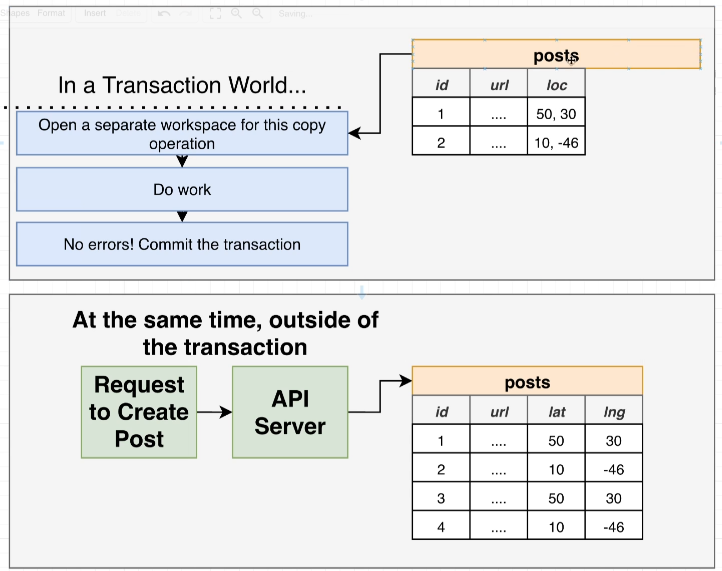
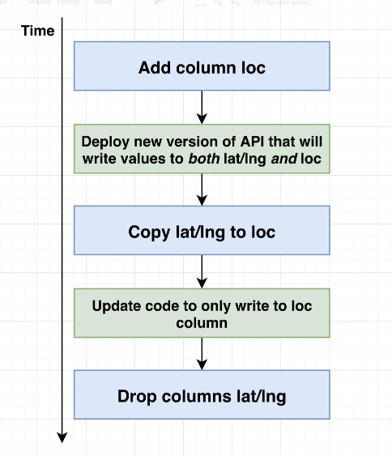

## View

### Simple View
```sql
-- create a view
CREATE VIEW tags AS (
        SELECT id, created_at, user_id, post_id, "photo_tag" AS type
        FROM photo_tags
    UNION ALL
        SELECT id, created_at, user_id, post_id, "photo_tag" AS type
        FROM caption_tags
);

-- change a view
CREATE OR REPLACE VIEW recent_posts AS (
    -- new query
);

-- drop a view
DROP VIEW recent_posts
```
A view is a fake table residing in memory that can be reffered to anytime after creating it, whereas CTE is only valid during the script execution. 
- View is useful when creating a new table with existing data, without touching the original ones.
- Views execute its query every time when it's refered 

### Materialized View
> [PostgreSQL Materialized View](https://www.postgresql.org/docs/current/sql-creatematerializedview.html)  
```sql
CREATE MATERIALIZED VIEW <table name> AS (
  -- sql statements
) WITH [NO] DATA;

-- Refresh the view later
REFRESH MATERIALIZED VIEW <table name>;
```
Materialized ones execute its query only at specific times such as once a week or once a day. The results are saved and can be referenced without rerunning the query. It automatically runs the query on its creation time unless `WITH NO DATA` option is provided.
- can benefit from performance by creating a table adapting to system's usecases
  - `ex) the 10 most recent posts -> can be used at many use-cases`
- If the data set is large and want to populate at another time, use `WITH NO DATA` option.
- Should be regularly refreshed to keep updated, otherwise it might have no longer invalid data.

## Transaction
  
- `BEGIN` to start a transaction section, which is isolated from other connections.
- Writing operations won't immediately applied to the table until `COMMIT` runs
- Loosing connection or crashing leads to automatic `ROLLBACK`
- When there's an error while on transaction, it becomes `aborted` state, and can be resolved by `ROLLBACK`


## Migration

Changes in scheme or data require its dependencies to do so, such as deployment and API servers. To manage database with versions to be able to revert changes at any time, language-agnostic migration plan is needed. 

### Syntax
> Migration Tool: [golang-migrate](https://github.com/golang-migrate/migrate)  
> Install: [migrate CLI](https://github.com/golang-migrate/migrate/tree/master/cmd/migrate)

Migration comes with `up` and `down` sql files for upgrading and downgrading. Some migration tools automatically generate those in pair, but generally should manually fill them up.  

1. Set environment variable for DB connection  
   `export POSTGRESQL_URL='postgres://<username>:<password>@localhost:5432/<dbname>?sslmode=disable'`
2. Create a migration plan (up and down)  
   `migrate create -ext sql <migration name>`
3. Write SQL statements for `up` and `down` on sql files created
   ```sql
    -- for up sql
    CREATE TABLE ...

    -- for down sql
    DROP TABLE
   ```
4. Run migrations  
   `migrate -database $POSTGRES_URL -path . up`
    - must provide `-path` option where migration SQL files are stored

### Scheme/Data
```python
Add Column loc          # Schema
Copy lat/lng to loc     # Data
Drop columns lat/lng    # Schema
```
- **Scheme**: changes in table's structure (column, constraints, ...)
- **Data**: copying/processing of existing data

  

It's not advisable to have scheme and data migrations at the same time. If new data is inserted during the data migration, we might have some data loss as above (rows 3 and 4).  

  
A solution is to split scheme and data migrations and to update the API server accordingly. For a data migration over a large dataset, one needs to implement **Batch Updates** to avoid delays on user-side.
