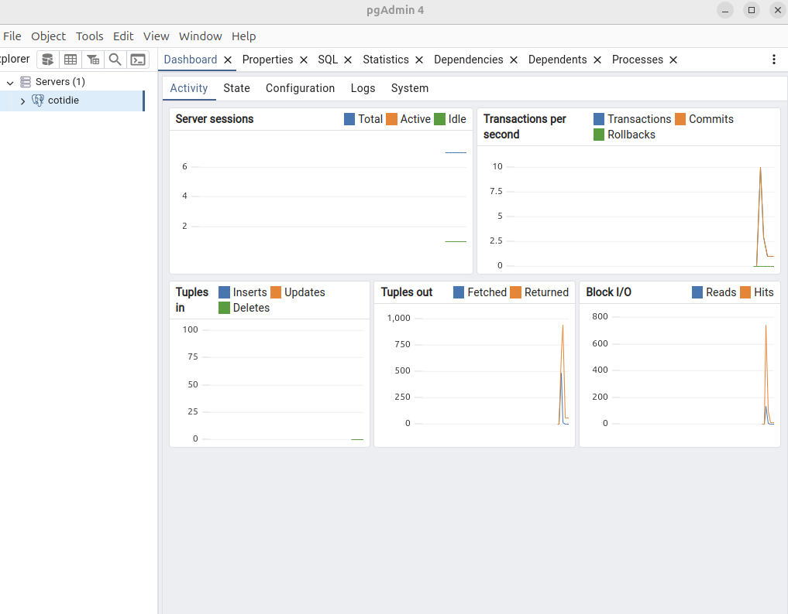
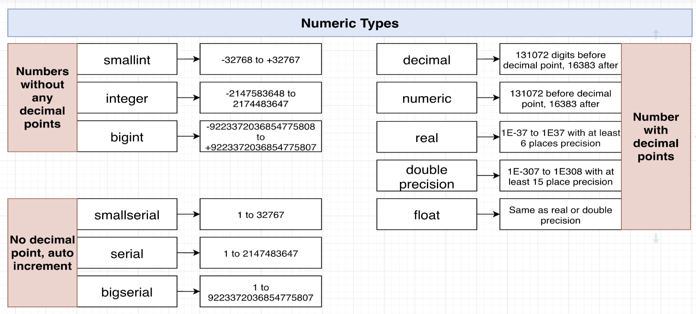
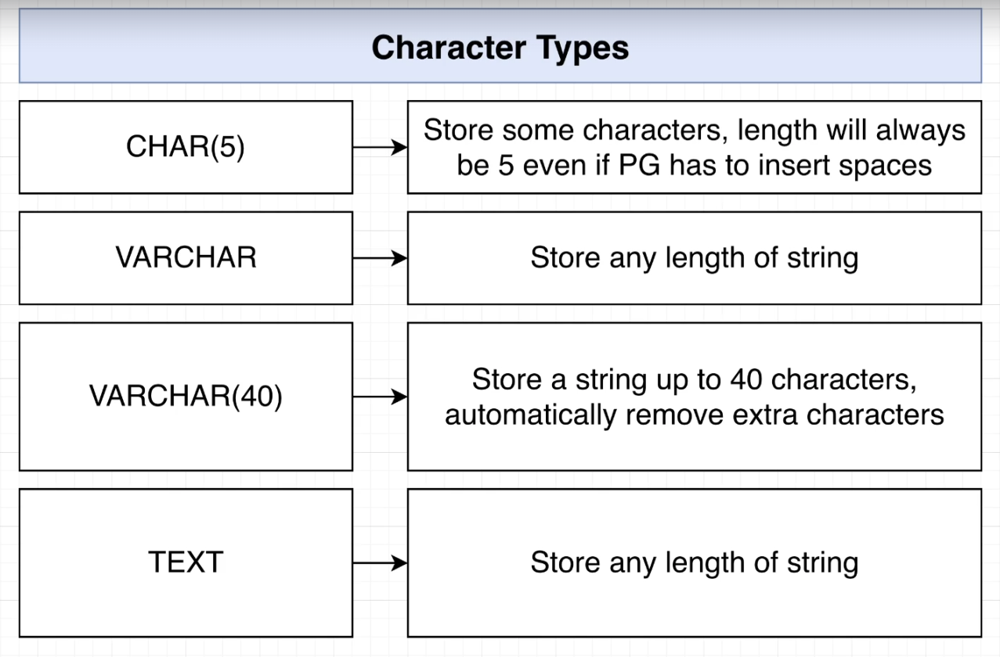
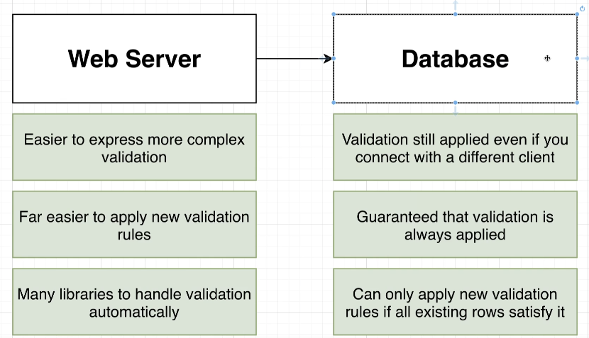

# PostgreSQL

## Installation
### PostgreSQL CLI
> Link: [Install psql](https://www.postgresql.org/download/)  

```bash
# 1. install `-contrib` package for additional utilities
sudo apt install postgresql postgresql-contrib
# 2. create a role associated with the current username or 'root'
sudo -u postgres createuser --interactive
----------------------------------------------
Output
Enter name of role to add: <username>
Shall the new role be a superuser? (y/n) y
----------------------------------------------
# 3. create a db with for the current username or 'root'
sudo -u postgres createdb <username>
# 4. `psql` command to run postgreSQL shell
sudo psql
# 5. list databases and switch to it
$ ALTER USER <username> WITH PASSWORD 'your password';
$ CREATE DATABASE <name>
$ \list
$ \connect <name>
```
 PostgreSQL authentication process requires both a role and a DB with the same name as UNIX account, or else login will fail. After successfully logging in to `psql shell`, you can type SQL commands for your liking.

### PostgreSQL GUI
  
> Link: [Install pgAdmin](https://www.pgadmin.org/download/pgadmin-4-apt/)  

```bash
# Install the public key for the repository (if not done previously):
curl -fsS https://www.pgadmin.org/static/packages_pgadmin_org.pub | sudo gpg --dearmor -o /usr/share/keyrings/packages-pgadmin-org.gpg

# Create the repository configuration file:
sudo sh -c 'echo "deb [signed-by=/usr/share/keyrings/packages-pgadmin-org.gpg] https://ftp.postgresql.org/pub/pgadmin/pgadmin4/apt/$(lsb_release -cs) pgadmin4 main" > /etc/apt/sources.list.d/pgadmin4.list && apt update'

# Install for both desktop and web modes:
sudo apt install pgadmin4

# Configure the webserver, if you installed pgadmin4-web:
sudo /usr/pgadmin4/bin/setup-web.sh
```
Then you can launch pgAdmin from the Ubuntu's application dock. To connect the `psql` databases, proceed with `Connect New Server` steps.

## Types
### Numeric
  
- `INTEGER`: Use when needs to store numbers without decimal points
- `NUMERIC`: Use when needs to store numbers with very accurate precision, such as scienctific data.
- `SEIRAL`: Use for primary keys like `id`
- `DOUBLE`: Use for any float numbers

To forcefully treat a value to a certain type, use `::type` keyword on a column.
- `ex) SELECT (2+2::SMALLINT)`

### Character
  
There's no difference in performance between types behind the scenes, and you can limit the size for validating data.

### Date
- `DATE`: 1980-11-20, NOV-20-1980, ...
- `TIME`: 01:23 AM, 20:23, ...
- `TIMESTAMP`: 1980-11-20 20:23, ...
- `TIME/TIMESTAMP WITH TIME ZONE`: 01:23 AM EST
- `INTERVAL`: duration of times which can be calculated 


## Validation
```sql
CREATE TABLE products(
    id SERIAL PRIMARY KEY,
    name VARCHAR UNIQUE,                       -- Constraint: Unique
    department VARCHAR NOT NULl DEFAULT 'new', -- Constraint: NOT NULL
    price INTEGER CHECK (price > 0), -- Constraint: Check
    UNIQUE(name, department), -- Multi Uniqueness
    CHECK(name != department) -- Multi Check
)
```
 You can prevent bad data from being inserted or updated before the query is applied, either using `Constraints` or `Validation Rules`.
- `CONSTRAINTS`: `UNIQUE`, `NOT NULL`, `DEFAULT`, `CHECK`
  
  
It's advisable to spread validation rules across web server for complex business rules, and database for critical data rules, as there might be multiple clients who use the same database with different purposes.