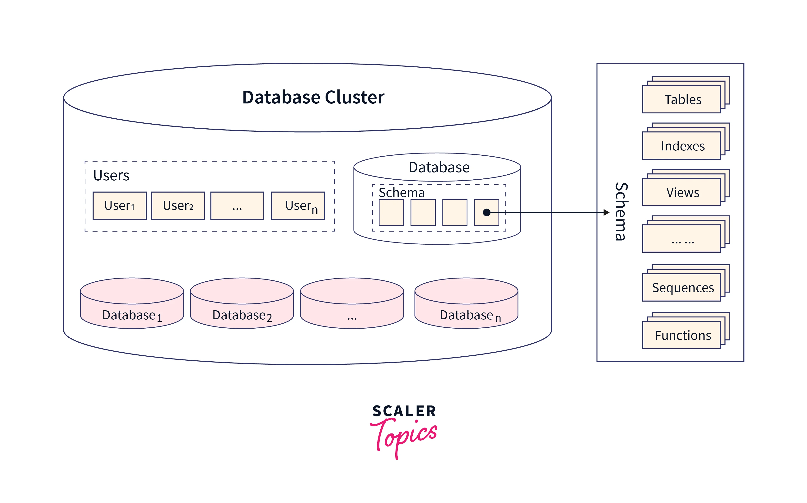
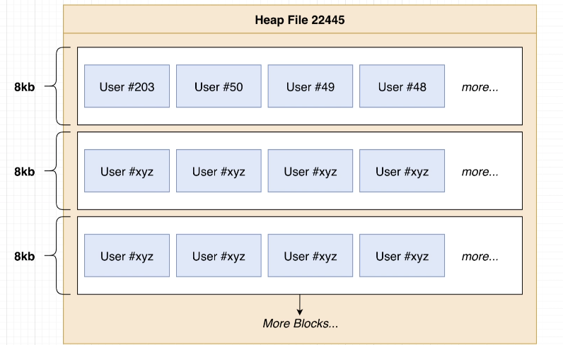
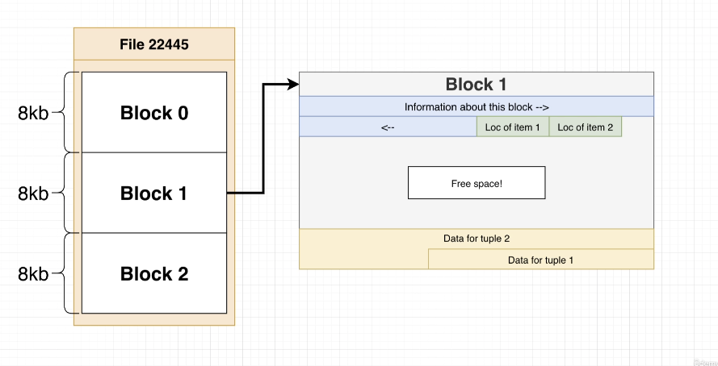
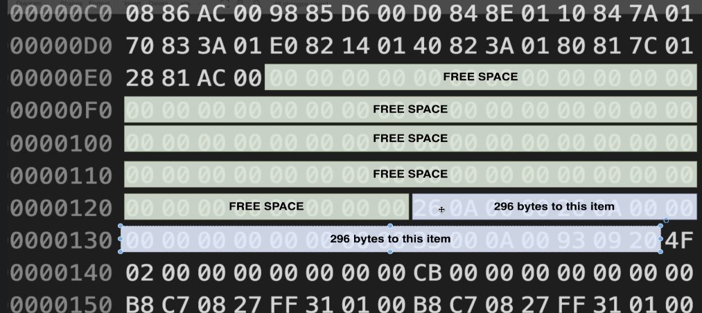
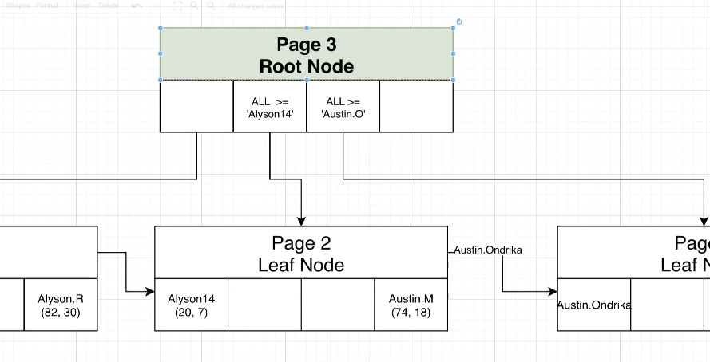

# Architecture
  

## Terms
  
- **Heap**: a file that contains all the data of a table
- **Block/Page**: The heap file is divided into multiple blocks, where a number of tuples are stored
- **Tuple/Item**: individual rows of a table (heap)

## Data Storage
```sql
-- To see the location where all the data is stored:
SHOW data_directory

-- To see OID of each database:
SELECT oid, datname FROM pg_database;

-- To see OID of each object related to a database:
SELECT * FROM pg_class

(root directory)
|- base
    |- (database)
        - (object)
        - (object)
        ...
    |- (database)
    |- ...
|- global
|- pg_commit_ts
|- pg_...
|- (other pg folders)
```

## Heap Layout
  
  
> [Overall Page Layout](https://www.postgresql.org/docs/current/storage-page-layout.html)  


A heap file consists of multiple pages which size is 8kb each. The structure of such a block is coded in a binary file with the layout as described on the page above. 
- Each page's layout is `Header - Item Info - Free Space - Items`

## Index

```sql
CREATE INDEX username_idx ON users(username);
DROP INDEX username_idx;
```
> index is automatically created on the primary key and `unique` constraints
 
To avoid full scans on a heap file to find desirable data and to improve hit rate, PG manages a list of shortcuts called `index` on RAM to load a particular block that stores the target data.
- create an index over a sortable column of a **table**
- each index item stores block and item number inside a heap file
- index is organized by a tree structure, which search complexity is `log n`

But `index` has some downsides in terms of performance. It's import to create an index on prequently used columns.
- Might take up large space proportional to the size of its table (`ex - 150kb to 800kb table`)
- Might slow down update/insert/delete operations since the index should be updated too

  
The search on `index` happens based on Btree which nodes indicate `less than` or `greater than` relationship to a target value. 